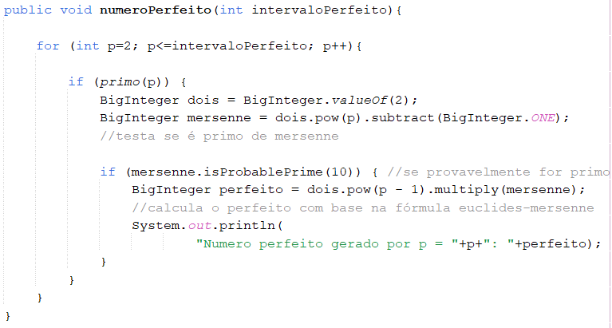
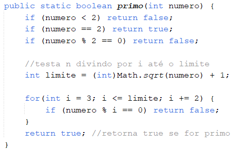
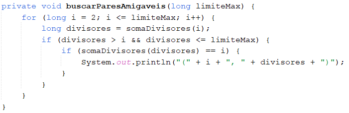
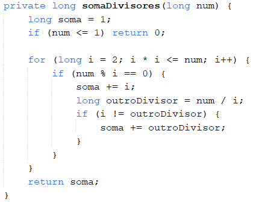
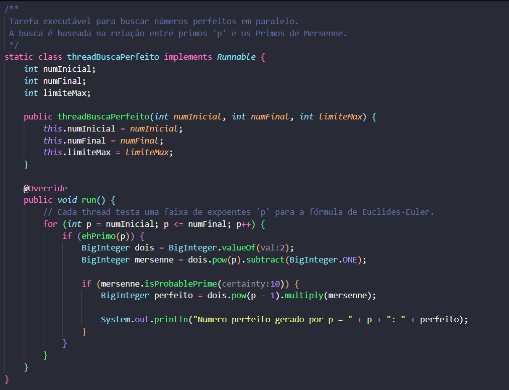
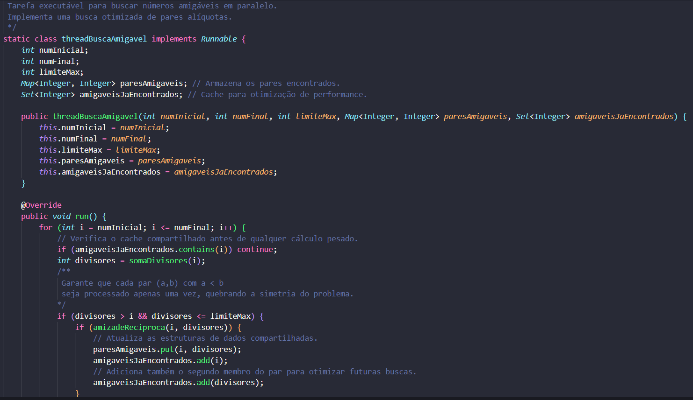
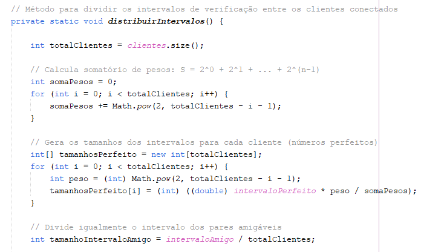
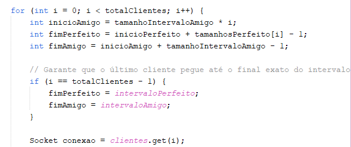
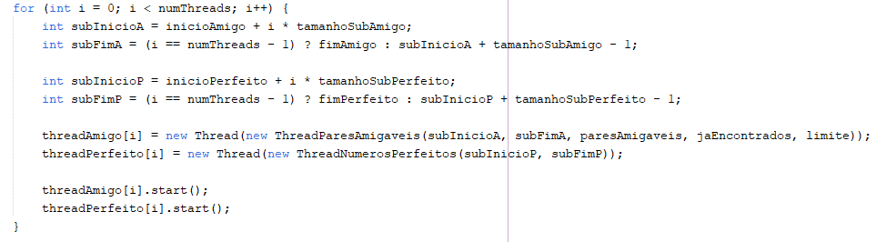

# 🧮 Verificação de Números Perfeitos e Amigáveis em Intervalos Grandes

Este projeto tem como objetivo comparar a eficiência das soluções nas abordagens **sequencial**, **paralela** e **distribuída** para a verificação de **números perfeitos** e **pares de números amigáveis**, em grandes intervalos. Foi desenvolvido em linguagem **Java**, utilizando os ambientes de desenvolvimento **NetBeans** e **VS Code** para a implementação e execução.

## ✨ Números Perfeitos

Números perfeitos são aqueles cuja soma de seus divisores - exceto ele mesmo - resulta no próprio número.

**Exemplo:**  
- Número 28:
  - Divisores: 1, 2, 4, 7, 14, 28
  - Soma dos divisores (exceto ele mesmo): 1 + 2 + 4 + 7 + 14 = 28  
- Portanto, **28 é um número perfeito**.

### 📐 Aplicação de Euclides-Mersenne

Além da verificação direta por meio da soma dos divisores, também é possível utilizar o **Teorema de Euclides-Euler**, com a fórmula de **Euclides-Mersenne**, que relaciona números primos de Mersenne com números perfeitos pares, para encontrar números perfeitos.

Um **primo de Mersenne** é um número da forma:

> **Mₙ = 2ⁿ − 1**, onde **n** também é primo.

Segundo o teorema, todo primo de Mersenne gera um número perfeito par, pela fórmula:

> **N = 2ⁿ⁻¹ × (2ⁿ − 1)**

**Exemplo:**  
Se **n = 3**, temos:  
- **M₃ = 2³ − 1 = 7** (primo de Mersenne)  
- Número perfeito: **N = 2² × 7 = 28**

Essa relação permite encontrar números perfeitos de forma mais eficiente, sem o custo computacional de analisar divisores de um por um.

 

## 🤝 Pares de Números Amigáveis

Os números amigáveis são determinados em pares amigos, dois números são considerados **amigáveis** se a soma dos divisores - exceto ele mesmo - de cada um resulta no outro.

**Exemplo:**  
- Par (220, 284):
  - Divisores de 220: 1, 2, 4, 5, 10, 11, 20, 22, 44, 55, 110, 220
  - Soma dos divisores (exceto ele mesmo): 1 + 2 + 4 + 5 + 10 + 11 + 20 + 22 + 44 + 55 + 110 = 284
  - Divisores de 284: 1, 2, 4, 71, 142
  - Soma dos divisores (exceto ele mesmo): 1 + 2 + 4 + 71 + 142 = 220  
- Portanto, **220 e 284 são amigos**.

Embora existam teoremas que auxiliem no cálculo manual de pares, não encontrou-se uma fórmula que permita ganho de desempenho computacional para a identificação de pares amigáveis em intervalos grandes. 

 

## ⚙️ Implementação

Nesta seção são apresentadas as três abordagens de implementação desenvolvidas para o projeto: **Sequencial**, **Paralela** e **Distribuída**. Cada abordagem contém a lógica para identificação de **números perfeitos** e de **pares de números amigáveis**, por meio de métodos, sendo executadas com diferentes intervalos, em uma mesma máquina.

### 📏 Intervalos

Para atingir intervalos maiores na busca por números perfeitos, optou-se por **calcular** os números perfeitos em vez de realizar uma varredura direta. A estratégia adotada baseia-se na geração de **primos de Mersenne**, que originam números perfeitos.

Assim, o intervalo definido para a função de números perfeitos refere-se ao valor de **p**, que representa o **expoente primo** utilizado para gerar o primo de Mersenne (Mₚ = 2ᵖ − 1). A partir de **p**, a função calcula os números perfeitos correspondentes, possibilitando a geração de números com milhares de dígitos.

Por outro lado, a verificação de **pares de números amigáveis** requer uma varredura **número a número**, uma vez que não há fórmula que permita sua geração direta com eficiência computacional. Nesse caso, o intervalo é aplicado diretamente ao valor numérico a ser testado, sendo realizada a análise completa da soma de divisores e da reciprocidade entre os possíveis pares, mas aplicando melhorias matemáticas que proporcionaram melhor desempenho.

#### 📊 Tabela de Intervalos Utilizados nos Testes

|  | Intervalo para `p` | Intervalo para Pares Amigáveis |
|---------|------------------------------------------|----------------------------|
| Teste 1 | Até 20.000 | Até 100.000.000 |
| Teste 2 | Até 12.000 | Até 50.000.000 |
| Teste 3 | Até 10.000 | Até 30.000.000 |

--- 

### 🧵 Sequencial

A implementação **sequencial** realiza o processamento utilizando apenas um núcleo de CPU, com execução linear das tarefas.   
O arquivo .java pode ser encontrado neste repositório pelo caminho: `/Códigos/src/main/java/Sequencial.java`

#### Função de Cálculo de Números Perfeitos:

- À esquerda, a função responsável por calcular o primo de mersenne a partir de **p** e, após, calcular o **número perfeito** derivado deste. 
- À direita, uma função de apoio, que é responsável por verificar se o número é primo.

|  |  |
|:---:|:---:|

#### Função de Verificação de Pares Amigáveis:  

- À esquerda, a função responsável por verificar se a soma de divisores de um número é **recíproca** com outro, determinando **pares amigáveis**. 
- À direita, uma função de apoio, que é responsável por calcular a **soma dos divisores**.

|  |  |
|:---:|:---:|

Para implementar a execução **paralela** e **distribuída** baseou-se na mesma lógica aplicada ao sequencial, fazendo apenas as adaptações necessárias nas funções citadas.

### 🧩 Paralela 

 A versão paralela distribui a carga de trabalho entre múltiplas threads em uma única máquina, explorando a estratégia de Dividir para Conquistar. O método `main` atua como um orquestrador que "fatia" os intervalos de busca e delega cada fatia para uma thread específica. As buscas por números perfeitos e amigáveis são lançadas para rodar simultaneamente, e o `main` aguarda a finalização de todas as threads (`join`) antes de apresentar os resultados consolidados da busca por números amigáveis.

 **Lógica das Threads Paralelas (Runnable)**
 Para alcançar o paralelismo, a lógica de cada busca foi encapsulada em uma classe que implementa a interface `Runnable`, definindo o "plano de trabalho" de cada thread.

 #### Busca por Números Perfeitos (`threadBuscaPerfeito`)
 A busca pelos expoentes `p` que geram os números perfeitos é dividida entre as threads. Cada thread, ao encontrar um primo de Mersenne, calcula o número perfeito correspondente e, na implementação atual, imprime o resultado diretamente no console.

 

 *Descrição da Imagem:* Classe `threadBuscaPerfeito` que implementa `Runnable`. Ela contém atributos para `numInicial`, `numFinal` e `limiteMax`, e um método `run()` que itera sobre um intervalo de expoentes `p`. Para cada `p`, verifica se é primo e, se for, calcula o Primo de Mersenne correspondente (`2^p - 1`). Se o Primo de Mersenne for provavelmente primo, calcula o número perfeito derivado (`2^(p-1) * (2^p - 1)`) e o imprime no console.

 #### Busca por Pares Amigáveis (`threadBuscaAmigavel`)
 A busca por pares amigáveis também é paralelizada, com cada thread investigando uma fatia do intervalo numérico. A eficiência desta busca é garantida por duas otimizações principais:

 * **Quebra de Simetria:** A verificação `divisores > i` garante que cada par `{a, b}` seja processado apenas uma vez, pelo seu membro menor.
 * **Cache Compartilhado:** Um `Set` concorrente (`amigaveisJaEncontrados`) é usado para que, quando uma thread encontra um par, ela adicione ambos os números a este conjunto. Outras threads consultam este conjunto antes de qualquer cálculo pesado e, se o número já estiver lá, pulam a verificação.

 

 *Descrição da Imagem:* Classe `threadBuscaAmigavel` que implementa `Runnable`. Ela possui atributos para `numInicial`, `numFinal`, `limiteMax`, um `Map` para `paresAmigaveis` e um `Set` para `amigaveisJaEncontrados`. O método `run()` itera sobre o intervalo numérico, verifica se o número já foi encontrado (otimização de cache), calcula a soma dos divisores e, se encontrar um par amigável recíproco, o adiciona ao `Map` de pares e ao `Set` de encontrados para otimização futura.

 #### Estruturas de Dados e Sincronização
 Para garantir a integridade dos dados com múltiplas threads acessando as coleções de resultados ao mesmo tempo, foram utilizadas estruturas de dados "thread-safe":

 * **`ConcurrentSkipListMap`**: Usado para armazenar os pares amigáveis. Garante acesso concorrente seguro e mantém os pares ordenados pela chave (o menor número do par).
 * **`ConcurrentHashMap.newKeySet()`**: Usado para o conjunto de otimização `amigaveisJaEncontrados`. Oferece altíssima performance para as operações de `add` e `contains`, o que é crucial para a eficiência da otimização da busca.

### 🌐 Distribuída

Na abordagem distribuída, o processamento é dividido entre múltiplos clientes, que se conectam a um servidor central via Sockets TCP. Cada cliente recebe um intervalo específico de trabalho e executa suas tarefas utilizando múltiplas threads internas. A distribuição dos intervalos é feita de forma exponencial, favorecendo os primeiros clientes conectados.
 
Embora os testes tenham sido realizados na mesma máquina, a arquitetura simula um ambiente real distribuído, com múltiplos processos independentes e comunicação em rede. 

#### Divisão de Intervalos no Servidor
- A imagem à esquerda se refere à distribuição do intervalo determinado em sub-intervalos que serão enviados aos clientes.  
- A imagem à direita se refere à divisão real, no qual esses sub-intervalos serão enviados para os seus respectivos clientes. 

|  |  |
|:---:|:---:|

#### Divisão de Subintervalos para Threads
- A imagem se refere à divisão do intervalo de cada cliente em sub-intervalos que serão calculados em cada thread.

 

 

## 📈 Análise

Nesta seção são apresentados os resultados obtidos nos testes de desempenho para as três abordagens: **sequencial**, **paralela** e **distribuída**. As comparações foram feitas com base no tempo de execução total para diferentes intervalos, considerando tanto números perfeitos quanto pares de números amigáveis. Também foram realizados testes específicos para avaliar a **escalabilidade** das abordagens paralela e distribuída, variando a quantidade de threads e processos.

### 💻 Configuração da Máquina

Todos os testes foram realizados na mesma máquina, com as seguintes configurações. É importante destacar que, embora a abordagem distribuída normalmente envolva múltiplos dispositivos, neste projeto todas as execuções ocorreram localmente, simulando um ambiente distribuído por meio de múltiplos processos independentes.

| Componente             | Especificação                                 |
|------------------------|-----------------------------------------------|
| Processador            | Intel(R) Core(TM) i5-10210U CPU @ 1.60GHz     |
| Memória RAM            | 8,00 GB                                       |
| Sistema Operacional    | Windows 11 64 bits                            |
| Quantidade de núcleos  | 4                                             |
| Armazenamento          | 477 GB SSD                                    |

### ⚖️ Comparativo

A tabela a seguir resume os tempos de execução dos três códigos para diferentes intervalos de teste.

| | Intervalo Perfeito (p) | Intervalo Amigável (n) | Sequencial | Paralela | Distribuída |
|---------|------------------------|------------------------|-----------------|-------------|----------------|
| Teste 1 | Até 20.000             | Até 100.000.000        |     2:30:00     |    47:45    |      37:08     |
| Teste 2 | Até 12.000             | Até 50.000.000         |      42:18      |    6:59     |      7:37      |
| Teste 3 | Até 10.000             | Até 30.000.000         |     19:45       |    3:18     |       3:20     |

### 📈 Teste de Escalabilidade

Os testes de escalabilidade foram realizados com o objetivo de avaliar como o desempenho das abordagens paralela e distribuída varia com o aumento da quantidade de threads e processos.

#### 🧩 Paralelo

No modelo paralelo, observa-se que o aumento do número de threads pode melhorar o desempenho até certo ponto. Contudo, após determinado limite, o ganho se estabiliza ou até mesmo regride, devido à sobrecarga de gerenciamento das threads e à limitação física.

| Threads | Tempo (min) |
|---------|-------------|
| 4       | 8:55        |
| 6       | 6:59        |
| 8       | 8:04        |

#### 🌐 Distribuído

Na versão distribuída, foram testadas combinações variadas de clientes e threads por cliente. Os resultados indicam que o uso de múltiplos clientes, em conjunto com threads internas, proporciona uma boa divisão de carga, com redução significativa do tempo de execução, mesmo em um ambiente local. 

| Threads - Clientes | Tempo (min) |
|--------------------|-------------|
| 2 - 2              | 8:33        |
| 2 - 3              | 7:37        |
| 3 - 2              | 7:13        |
| 2 - 4              | 6:09        |
| 4 - 2              | 6:54        |

### 📝 Visão Geral
Os testes realizados visam comparar as três abordagens distintas. Por meio deles, foi possível observar que:
- Na versão **sequencial**, todas as operaçoes são realizadas em um único fluxo de execução, o que resulta em maior tempo de processamento devido à ausÊncia de paralelismo;  
- A implementação **paralela** explora múltiplas threads dentro de uma mesma máquina para dividir o trabalho, permitindo a execução simultânea de várias tarefas e, consequentemente, reduzindo o tempo total de processamento;  
- Já a abordagem **distribuída** simula um ambiente distribuído, onde múltiplos clientes se conectam a um servidor central via sockets TCP e recebem intervalos de trabalho para processar. Como todas as execuções ocorrem em uma única máquina, cada cliente utiliza múltiplas threads internas para paralelizar seu processamento localmente. Essa combinação de distribuição entre processos independentes (clientes), paralelismo interno (threads) e divisão exponencial de intervalo de números perfeitos, permite uma divisão eficiente da carga, tornando essa abordagem mais rápida que a sequencial e, em muitos casos, até mesmo mais eficiente que a paralela tradicional.

 

## 📂 Estrutura dos Arquivos

- **/códigos** – Contém o código-fonte Java (sequencial, paralelo e distribuído)
- **/docs** – Documentação técnica e gráficos de desempenho
- **/outputs** – Resultados das execuções em diferentes intervalos
- **README.md** – Arquivo de descrição do projeto

 

## 🧱 Desafios e Soluções

 - Desafio: O Limite do Tipo Long

Durante os testes, nos deparamos com uma limitação importante: o tipo long, utilizado em muitos cálculos, suporta apenas números de até 19 dígitos. Isso se tornou um obstáculo, pois trabalhar com números extremamente grandes, como os envolvidos na geração de números perfeitos, simplesmente não seria possível com esse tipo de dado.

- Solução: Euclides-Mersenne e BigInteger

Com a fórmula de Euclides-Mersenne conseguimos contornar esse desafio. Essa fórmula, combinada com o uso do tipo BigInteger, permitiu ultrapassar de forma eficiente o limite do long. Isso foi essencial para alcançar intervalos maiores. Saímos de um limite de 19 dígitos para números que possuem até 12.000 dígitos. Ou seja, conseguimos explorar um intervalo mais de 600 vezes maior do que seria possível com o long.

## 🚀 Melhorias

- Balanceamento dinâmico de carga entre clientes atualmente

Cada cliente recebe um intervalo fixo do servidor. Uma melhoria seria implementar um sistema onde quando um cliente termina sua tarefa antes dos outros, ele possa assumir parte da carga de outro cliente ainda execução, evitando que o tempo total dependa do cliente mais lento.

- Retorno de resultados ao servidor na implementação Atual

O servidor apenas distribui os intervalos e não recebe os resultados de volta. Uma melhoria seria permitir que os clientes enviassem no mínimo um aviso de finalização ao servidor, podendo também enviar seus tempos de execução, os pares encontrados e os números perfeitos encontrados. Dessa forma haveria um controle centralizado, um monitoramento em tempo real e a possibilidade de consolidar resultados em um único ponto. 

- Criação dinâmica de threads com thread pool

A quantidade de threads nos clientes e no código paralelo é definida de forma fixa, assim uma abordagem mais eficiente seria utilizar um Thread Pool, um conjunto de threads reutilizáveis controlado dinamicamente. Isso evita o custo de criar e destruir threads repetidamente, reduzindo a sobrecarga e melhorando o uso de CPU.

- Execução realmente distribuída (com múltiplos computadores) 

Embora a arquitetura seja distribuída, os testes foram feitos em uma única máquina. Uma melhoria importante seria executar os clientes em máquinas diferentes, conectadas em rede real, assim tendo paralelismo real entre dispositivos, sem disputa por CPU, resultando em ganhos reais de desempenho.

 

## ✅ Conclusão

Concluimos que paralelizar já traz ótimos ganhos, e distribuir só compensa em cargas muito altas. Também entendemos que mais threads nem sempre significam mais desempenho. Superamos o limite do long com a fórmula de Euclides-Mersenne, o que foi essencial pra alcançar números muito maiores.

